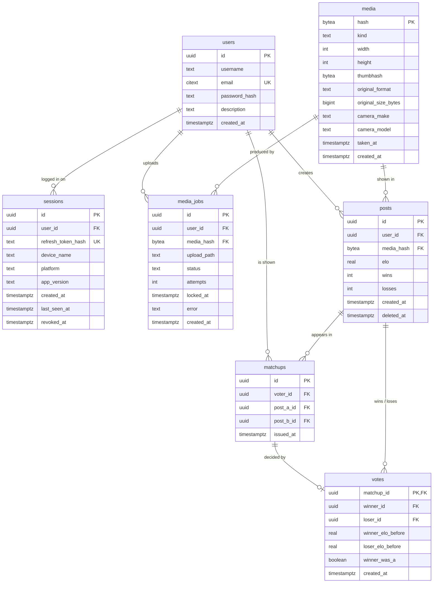

```mermaid
erDiagram
    users {
        uuid id PK
        text username
        citext email UK
        text password_hash
        text description
        timestamptz created_at
    }
    sessions {
        uuid id PK
        uuid user_id FK
        text refresh_token_hash UK
        text device_name
        text platform
        text app_version
        timestamptz created_at
        timestamptz last_seen_at
        timestamptz revoked_at
    }
    media {
        bytea hash PK
        text kind
        int width
        int height
        bytea thumbhash
        text original_format
        bigint original_size_bytes
        text camera_make
        text camera_model
        timestamptz taken_at
        timestamptz created_at
    }
    media_jobs {
        uuid id PK
        uuid user_id FK
        bytea media_hash FK
        text upload_path
        text status
        int attempts
        timestamptz locked_at
        text error
        timestamptz created_at
    }
    posts {
        uuid id PK
        uuid user_id FK
        bytea media_hash FK
        real elo
        int wins
        int losses
        timestamptz created_at
        timestamptz deleted_at
    }
    matchups {
        uuid id PK
        uuid voter_id FK
        uuid post_a_id FK
        uuid post_b_id FK
        timestamptz issued_at
    }
    votes {
        uuid matchup_id PK, FK
        uuid winner_id FK
        uuid loser_id FK
        real winner_elo_before
        real loser_elo_before
        boolean winner_was_a
        timestamptz created_at
    }

    users ||--o{ sessions : "logged in on"
    users ||--o{ posts : creates
    media ||--o{ posts : "shown in"
    users ||--o{ media_jobs : uploads
    media ||--o{ media_jobs : "produced by"
    users ||--o{ matchups : "is shown"
    posts ||--o{ matchups : "appears in"
    matchups ||--o| votes : "decided by"
    posts ||--o{ votes : "wins / loses"
```