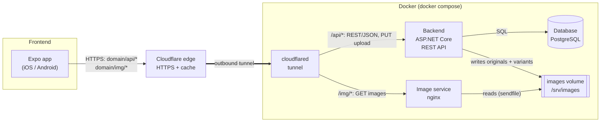

```mermaid
flowchart LR
    subgraph client["Frontend"]
        app["Expo app<br/>(iOS / Android)"]
    end

    cf["Cloudflare edge<br/>HTTPS + cache"]

    subgraph docker["Docker (docker compose)"]
        tunnel["cloudflared<br/>tunnel"]
        backend["Backend<br/>ASP.NET Core<br/>REST API"]
        images["Image service<br/>nginx"]
        db[("Database<br/>PostgreSQL")]
        vol[["images volume<br/>/srv/images"]]
    end

    app -- "HTTPS: domain/api/*<br/>domain/img/*" --> cf
    cf == "outbound tunnel" ==> tunnel

    tunnel -- "/api/*: REST/JSON, PUT upload" --> backend
    tunnel -- "/img/*: GET images" --> images

    backend -- "SQL" --> db
    backend -- "writes originals + variants" --> vol
    images -- "reads (sendfile)" --> vol
```