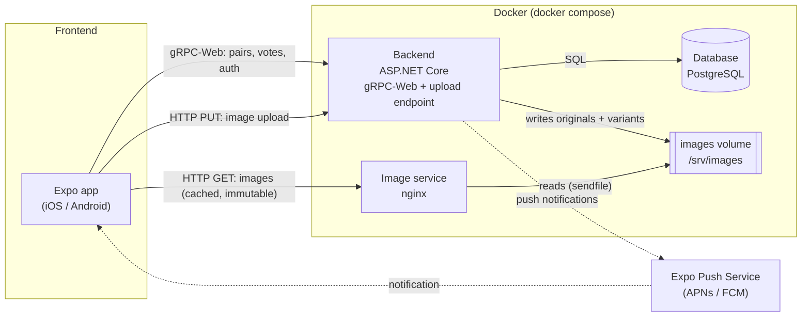

```mermaid
flowchart LR
    subgraph client["Frontend"]
        app["Expo app<br/>(iOS / Android)"]
    end

    subgraph docker["Docker (docker compose)"]
        backend["Backend<br/>ASP.NET Core<br/>gRPC-Web + upload endpoint"]
        images["Image service<br/>nginx"]
        db[("Database<br/>PostgreSQL")]
        vol[["images volume<br/>/srv/images"]]
    end

    push["Expo Push Service<br/>(APNs / FCM)"]

    app -- "gRPC-Web: pairs, votes, auth" --> backend
    app -- "HTTP PUT: image upload" --> backend
    app -- "HTTP GET: images (cached, immutable)" --> images

    backend -- "SQL" --> db
    backend -- "writes originals + variants" --> vol
    images -- "reads (sendfile)" --> vol

    backend -. "push notifications" .-> push
    push -. "notification" .-> app
```