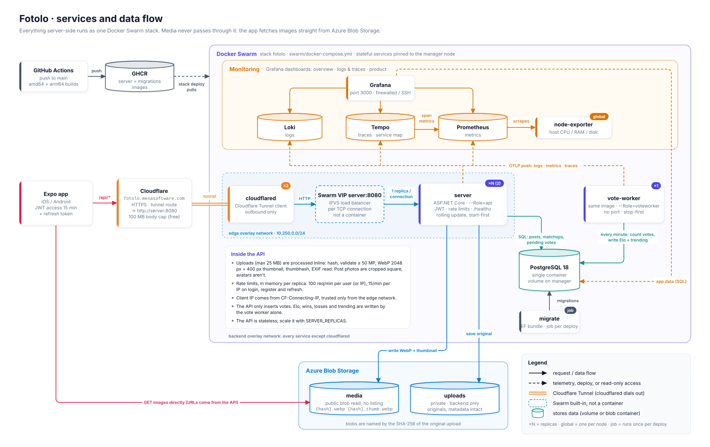
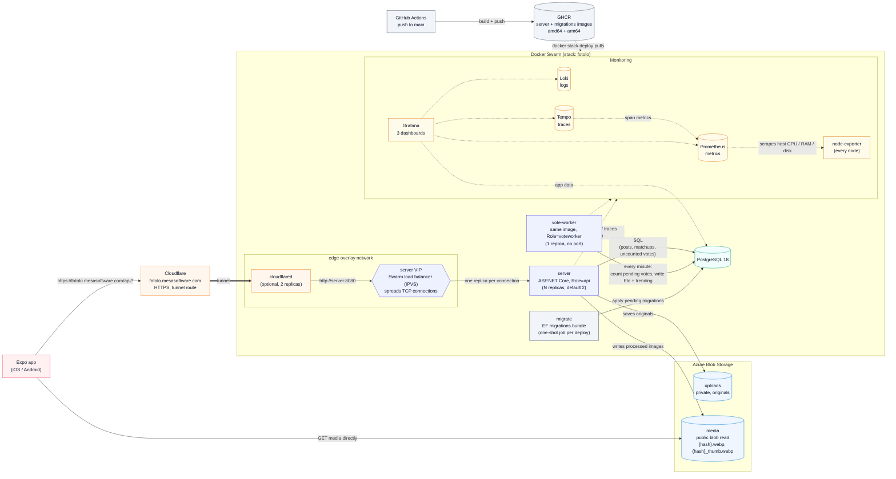
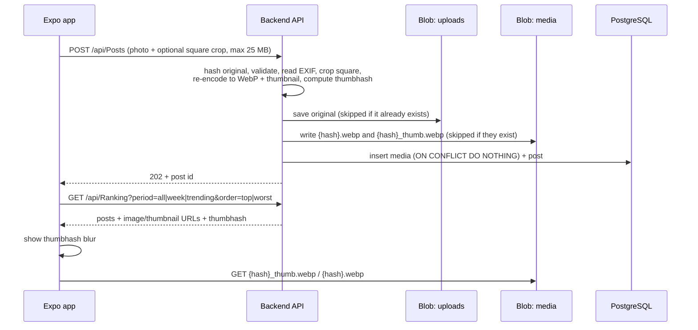
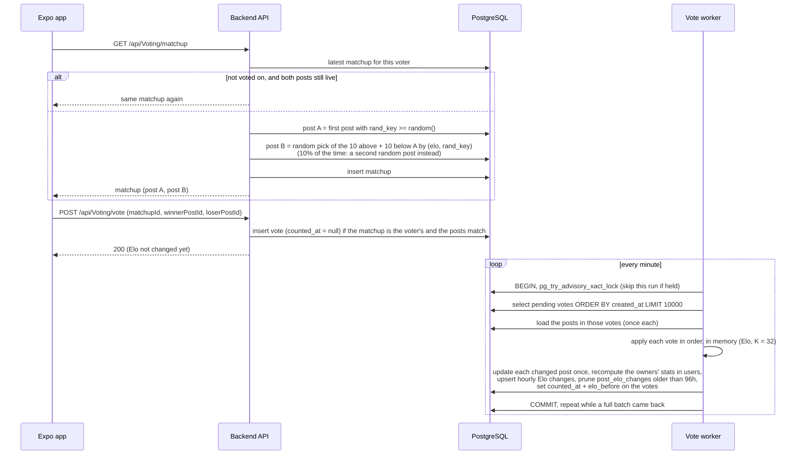

# Services

The picture above is laid out by hand (`diagrams/src/services.py`). The Mermaid diagrams below show the same thing, auto-laid-out, and render directly on GitHub. Rendered copies of them are in `diagrams/mermaid/`.

```mermaid
flowchart LR
    app["Expo app<br/>(iOS / Android)"]
    cf["Cloudflare<br/>fotolo.mesasoftware.com<br/>HTTPS, tunnel route"]
    ci["GitHub Actions<br/>push to main"]
    ghcr[("GHCR<br/>server + migrations images<br/>amd64 + arm64")]

    subgraph azure["Azure Blob Storage"]
        uploads[("uploads<br/>private, originals")]
        media[("media<br/>public blob read<br/>#123;hash#125;.webp, #123;hash#125;_thumb.webp")]
    end

    subgraph swarm["Docker Swarm (stack: fotolo)"]
        subgraph edge["edge overlay network"]
            tunnel["cloudflared<br/>(optional, 2 replicas)"]
            vip{{"server VIP<br/>Swarm load balancer (IPVS)<br/>spreads TCP connections"}}
        end

        backend["server<br/>ASP.NET Core, Role=api<br/>(N replicas, default 2)"]
        worker["vote-worker<br/>same image, Role=voteworker<br/>(1 replica, no port)"]
        migrate["migrate<br/>EF migrations bundle<br/>(one-shot job per deploy)"]

        db[("PostgreSQL 18")]

        subgraph obs["Monitoring"]
            prom[("Prometheus<br/>metrics")]
            loki[("Loki<br/>logs")]
            tempo[("Tempo<br/>traces")]
            grafana["Grafana<br/>3 dashboards"]
            nodeexp["node-exporter<br/>(every node)"]
        end
    end

    ci -- "build + push" --> ghcr
    ghcr -. "docker stack deploy pulls" .-> swarm

    app -- "https://fotolo.mesasoftware.com/api/*" --> cf
    cf == "tunnel" ==> tunnel
    tunnel -- "http://server:8080" --> vip
    vip -- "one replica per connection" --> backend

    app -- "GET media directly" --> media

    backend -- "SQL<br/>(posts, matchups, uncounted votes)" --> db
    worker -- "every minute:<br/>count pending votes, write Elo + trending" --> db
    migrate -- "apply pending migrations" --> db
    backend -- "saves originals" --> uploads
    backend -- "writes processed images" --> media

    backend -. "logs / metrics / traces (OTLP)" .-> obs
    worker -.-> obs
    tempo -. "span metrics" .-> prom
    grafana -.-> prom
    grafana -.-> loki
    grafana -.-> tempo
    grafana -. "app data" .-> db
    prom -. "scrapes host CPU / RAM / disk" .-> nodeexp

    classDef client fill:#fff1f2,stroke:#e11d48,color:#0f172a
    classDef edgeSvc fill:#fff7ed,stroke:#f38020,color:#0f172a
    classDef compute fill:#eef2ff,stroke:#4f46e5,color:#0f172a
    classDef store fill:#f0fdfa,stroke:#0d9488,color:#0f172a
    classDef monitor fill:#fffbeb,stroke:#d97706,color:#0f172a
    classDef blob fill:#eff6ff,stroke:#0078d4,color:#0f172a
    classDef ops fill:#f1f5f9,stroke:#475569,color:#0f172a
    class app client
    class cf,tunnel edgeSvc
    class vip,backend,worker compute
    class db store
    class prom,loki,tempo,grafana,nodeexp monitor
    class uploads,media blob
    class ci,ghcr,migrate ops
```

- **Deployment:** everything runs as one Docker Swarm stack, defined in `swarm/docker-compose.yml`. On every push to `main`, CI builds the `server` and `migrations` images for amd64 and arm64 and pushes them to GHCR. `docker stack deploy` pulls them. Stateful services (Postgres, Loki, Prometheus, Tempo, Grafana) are pinned to the manager node, because their volumes are local to it.
- **No gateway.** The public hostname `fotolo.mesasoftware.com` is a Cloudflare Tunnel route (type HTTP, URL `server:8080`): cloudflared forwards to `http://server:8080`. Inside the stack, Swarm's DNS resolves `server` to one virtual IP for the whole service, and Swarm's built-in load balancer (IPVS, part of the overlay network, not a container) hands each new TCP connection to a healthy replica in turn. It balances connections, not requests: cloudflared reuses keep-alive connections, so the requests on one connection all go to the same replica. Cloudflare in turn spreads requests across the cloudflared replicas. The published port `8080` goes through Swarm's ingress routing mesh, which balances the same way, but the tunnel doesn't use it. The backend sets its own upload limit (25 MB). Cloudflare's free plan caps request bodies at 100 MB.
- **Two overlay networks.** `edge` (`10.250.0.0/24`) holds only cloudflared and the server. `backend` holds every service except cloudflared, so the tunnel can't reach Postgres or the monitoring stack. The server reads the client IP from `CF-Connecting-IP` and trusts that header only from the `edge` subnet (`TrustedProxyNetwork`).
- **The backend is stateless**, so it scales by adding replicas (`SERVER_REPLICAS`, default 2). All state lives in Postgres and Azure Blob Storage. The one exception is rate limiting, which is counted in memory on each replica: 100 requests per minute per user (or per IP when logged out), and 15 per minute per IP on login, register and refresh. Updates roll one replica at a time, start-first, and roll back on failure. The health check is `GET /healthz`, which only returns 200 when Postgres answers.
- **The vote worker** is the same Docker image as the backend, started with `--Role=voteworker`. In that mode it runs one `BackgroundService` and maps no API endpoints. It's its own service with exactly 1 replica, no published port, and `stop-first` updates, so two workers never overlap during a deploy. The API replicas never write Elo. See [Vote counting flow](#vote-counting-flow).
- **Migrations** run as a Swarm `replicated-job` on every deploy. Swarm ignores `depends_on`, so the job retries until Postgres is up, and the server and worker restart until the schema exists. Locally there is no migrate job: run `dotnet ef database update` in `Server/`.
- **Photos only for now.** `media.kind` stays so video can be added later, but nothing handles video yet.
- **Uploads are processed inline** in the request: the backend hashes the original, validates the image (max 50 megapixels), bakes in the EXIF orientation, resizes it and re-encodes it to WebP. Post photos are cropped square (the app can send the crop); avatars keep their shape. At most one image per CPU core is processed at a time. The processed images carry no metadata.
- **EXIF data** (camera make/model, capture time) is saved in the `media` table but never returned by the API. It's there in case the app shows it later.
- **Azure Blob Storage** has two containers. Blobs are named by the SHA-256 of the original upload, so re-uploading the same file reuses the existing blobs.
  - `uploads` is private and holds the original file, metadata intact. Only the backend can access it.
  - `media` allows anonymous blob-level read, so blobs can be fetched by exact name but the container can't be listed. Each image is stored twice: `{hash}.webp` (max 2048 px) and `{hash}_thumb.webp` (max 400 px).
- **The app fetches media directly from Azure.** Media never goes through the stack. The DB stores only the hash, and the API builds the URLs.
- **Thumbhash placeholders:** each upload also gets a [ThumbHash](https://evanw.github.io/thumbhash/), a ~25-byte encoding of a blurred version of the image, stored in `media.thumbhash`. The API sends it (base64) with every post, and the app shows it as a blur until the thumbnail has loaded.
- **Sessions:** login returns a 15-minute JWT access token and a refresh token. Only the refresh token's SHA-256 hash is stored, in `sessions`. Each refresh swaps it for a new one in a single conditional update, so two refreshes racing on the same token can't both succeed. Logging in revokes the user's earlier sessions on the same device, matched by a per-install `device_id` the app sends, not by device name.
- **Credentials:** the backend authenticates to Azure with a connection string (`ConnectionStrings:Blobs`). The app never holds storage credentials. The vote worker gets no blob credentials at all.
- **Postgres** runs as a single container with a volume on the manager node, updated `stop-first` so two instances never share the data directory.
- **Monitoring:** the backend and the worker push logs to Loki, metrics to Prometheus and traces to Tempo, all over OTLP. node-exporter runs on every node and Prometheus scrapes it for host CPU, RAM and disk. Tempo also turns the traces into a service map and per-endpoint metrics, which it writes to Prometheus. Grafana shows all of it, plus app data queried straight from Postgres. On startup it loads three dashboards from `swarm/`: `Fotolo overview` (health and load), `Fotolo logs & traces` (searchable logs, recent, slow and failed traces, service map; log lines link to their trace and back) and `Fotolo product` (users, posts, votes, activity, leaderboards, platforms, cameras). Its port (3000) should be firewalled or reached over an SSH tunnel.
- **Local development** runs only the infrastructure in Docker (`docker-compose.infra.yml`: Postgres, Loki, Prometheus, Tempo, Grafana) and the backend with `dotnet run`. With no `Role` set it runs as `all`: the API and the vote worker in one process. It points at a real Azure storage account. There is no local emulator.

## Media upload flow

```mermaid
sequenceDiagram
    participant App as Expo app
    participant API as Backend API
    participant Up as Blob: uploads
    participant Media as Blob: media
    participant DB as PostgreSQL

    App->>API: POST /api/Posts (photo + optional square crop, max 25 MB)
    API->>API: hash original, validate, read EXIF, crop square,<br/>re-encode to WebP + thumbnail, compute thumbhash
    API->>Up: save original (skipped if it already exists)
    API->>Media: write {hash}.webp and {hash}_thumb.webp (skipped if they exist)
    API->>DB: insert media (ON CONFLICT DO NOTHING) + post
    API-->>App: 202 + post id

    App->>API: GET /api/Ranking?period=all|week|trending&order=top|worst
    API-->>App: posts + image/thumbnail URLs + thumbhash
    App->>App: show thumbhash blur
    App->>Media: GET {hash}_thumb.webp / {hash}.webp
```

## Vote counting flow

```mermaid
sequenceDiagram
    participant App as Expo app
    participant API as Backend API
    participant DB as PostgreSQL
    participant W as Vote worker

    App->>API: GET /api/Voting/matchup
    API->>DB: latest matchup for this voter
    alt not voted on, and both posts still live
        API-->>App: same matchup again
    else
        API->>DB: post A = first post with rand_key >= random()
        API->>DB: post B = random pick of the 10 above + 10 below A by (elo, rand_key)<br/>(10% of the time: a second random post instead)
        API->>DB: insert matchup
        API-->>App: matchup (post A, post B)
    end

    App->>API: POST /api/Voting/vote (matchupId, winnerPostId, loserPostId)
    API->>DB: insert vote (counted_at = null) if the matchup is the voter's and the posts match
    API-->>App: 200 (Elo not changed yet)

    loop every minute
        W->>DB: BEGIN, pg_try_advisory_xact_lock (skip this run if held)
        W->>DB: select pending votes ORDER BY created_at LIMIT 10000
        W->>DB: load the posts in those votes (once each)
        W->>W: apply each vote in order, in memory (Elo, K = 32)
        W->>DB: update each changed post once, recompute the owners' stats in users,<br/>upsert hourly Elo changes, prune post_elo_changes older than 96h,<br/>set counted_at + elo_before on the votes
        W->>DB: COMMIT, repeat while a full batch came back
    end
```

- **Matchups:** the voter never gets their own posts. Picking post B near post A by Elo keeps matchups close, and the occasional fully random post B lets new or badly placed posts move fast. Every step is a small query on an index (see `DatabaseDiagram.md`), so a matchup costs the same however many posts there are.
- **Why the votes are counted in one place:** Elo depends on the order votes are applied. With one worker the result is the same as counting each vote live, and API replicas never race each other updating the same post row.
- **Smart batching:** a post that appears in 50 pending votes is read once and written once per batch, not 50 times. Votes are still applied one by one in `created_at` order, so the Elo math is exact.
- **Safe to restart or double-start:** each batch is one transaction, so a crash just leaves those votes pending for the next run. The advisory lock means a second worker would skip the run instead of counting twice.
- **Rankings:** `GET /api/Ranking` takes a `period` (`all`, `week` or `trending`) and an `order` (`top` or `worst`) and returns 10 posts. `all` and `week` sort live posts by Elo (`week` only those created this week, Monday to Sunday UTC). `trending` sums the hourly Elo changes the worker wrote over the last 48 hours per live post: `top` is the 10 biggest risers, `worst` the 10 biggest fallers. All of them are as fresh as the last counting run. The response carries `Cache-Control: public, s-maxage=30`, so a shared cache such as Cloudflare may keep it for up to 30 seconds if a cache rule allows it.
- **Deleted posts:** a vote on a post that was deleted before counting is counted like any other. The deleted post's Elo changes, but it no longer appears in rankings or matchups.
- **The interval is fixed at one minute** (`PollInterval` in `VoteWorker.cs`). Shorter means fresher rankings and smaller batches.
